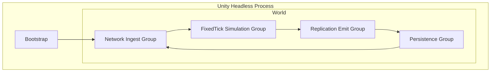

# Dedicated Server (Unity Headless) — Architecture (Server-Only View)

*Reference:* Unity Entities docs (`com.unity.entities@6.5`), Unity Jobs docs, Unity Burst docs.

---

## 1. Server Runtime Profile
- Unity headless build (`-batchmode -nographics`).
- No Entities Graphics, no camera, no UI.
- Fixed tick simulation (recommended: `30Hz`).

---

## 2. Server Worlds & Groups



Group responsibilities:
- `Network Ingest`: decode messages and enqueue validated command envelopes.
- `FixedTick Simulation`: apply deterministic state transitions.
- `Replication Emit`: build per-connection packets (`snapshot`, `delta`, `state`).
- `Persistence`: append events and periodic snapshots.

---

## 3. Server Data Ownership (Authoritative State)

```mermaid
flowchart LR
  CmdQ[Command Queue\n(per connection)] --> Sim
  Sim --> WorldState[World State\n(Chunk SoA + Rail Graph + Trains)]
  WorldState --> Rep[Replicator\n(per connection)]
  Rep --> OutQ[Outbound Packet Queues]
  OutQ --> Transport[Unity Transport Server]
```

Authoritative state buckets:
- Map: chunk SoA arrays + version counters.
- Rails: compact graph + adjacency + topology version.
- Trains: segment-relative state + speed state.

---

## 4. Fixed Tick Pipeline (Server)

```mermaid
flowchart TB
  A[Tick Start] --> B[Drain Cmd Queue\n(tick-ordered)]
  B --> C[Validate Commands\n(build/terraform)]
  C --> D[Apply Mutations\n(height/rails)]
  D --> E[Derived Recompute Jobs\n(sea->slope->build_mask)]
  E --> F[Vehicle Simulation]
  F --> G[Emit Events + TrainStates]
  G --> H[Tick End]
```

Notes:
- Sea is derived from `height + sea_level` and river override.
- Rivers are static and not recomputed by terraform.

---

## 5. Replication Model (Server Responsibilities)

### 5.1 Join
1. Send `ServerHello(seed, version, dims, chunk_size, sea_level)`.
2. Stream `ChunkSnapshot` in priority order.
3. Send initial rail topology and train states.

### 5.2 Steady State
- Reliable ordered:
  - rail placement events
  - terraform patches
  - topology updates
- Unreliable sequenced:
  - train state snapshots

### 5.3 Resync
- Server may issue full `ChunkSnapshot` for correction.
- Production extension: checksum-driven mismatch recovery.

---

## 6. Server Command Contract

Minimum command envelope fields:
- `connection_id`
- `player_id`
- `client_tick`
- `server_tick_received`
- `command_id`
- `command_type`
- `payload`

Validation gates:
- protocol version
- permissions/ownership
- bounds and invariant checks
- anti-spam limits per tick

Idempotency:
- dedupe by `(player_id, command_id)`.

---

## 7. Determinism Rules (Server)
- No use of `UnityEngine.Random` in simulation.
- Use fixed-step tick for all authoritative mutations.
- Seeded, stage-tagged deterministic worldgen.
- Integer authoritative fields where feasible (`u8/u16/q16`).
- No dependence on iteration order for random outcomes.

---

## 8. Performance & Safety Constraints
- No per-tile entities.
- Burst-compatible jobs for map and derived recompute.
- Avoid structural changes in hot loops; use ECB batching.
- Keep replication payload chunk-scoped and versioned.
- Keep command processing bounded per tick.

---

## 9. Operational Readiness

Runtime flags:
- `-batchmode -nographics`
- fixed target tick setting
- deterministic server seed + worldgen version

Observability (minimum):
- tick duration histogram
- commands accepted/rejected counters
- per-connection outbound bytes
- chunk snapshot queue depth
- replication latency estimates

Failure policy:
- reject invalid commands with reason codes
- safe fallback to chunk resnapshot on client divergence

---

## 10. Vertical Slice Deliverables (Server)
- Transport server bootstrap and handshake.
- Authoritative fixed-tick pipeline in defined order.
- Chunk snapshot streaming for initial join.
- Reliable terraform/rail events.
- Unreliable train-state stream.
