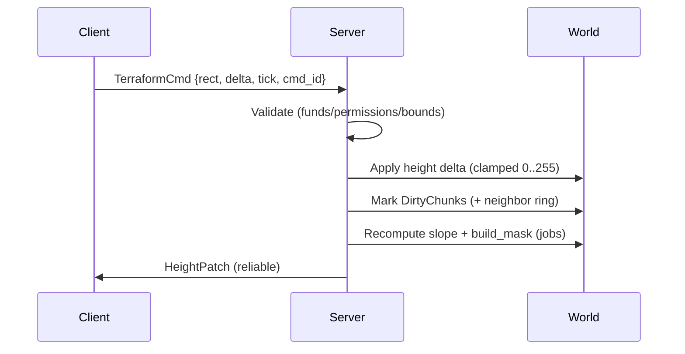
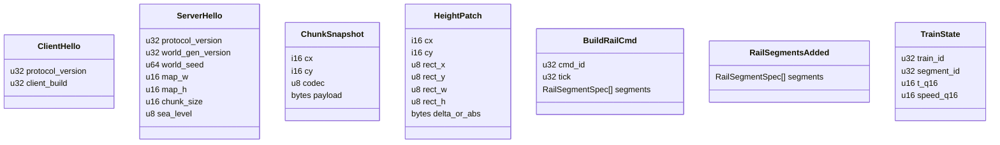

# Full-Scale Architecture (Production) — OpenTTD-like in Unity 6.5 ECS/DOTS

*Audience:* engine + gameplay engineers  
*Tone:* production / enterprise / performance-first  
*Reference:* Unity Entities docs (`com.unity.entities@6.5`), Unity Burst docs, Unity Jobs docs.

---

## 0. Locked Decisions (Non-Negotiables)

| Topic | Decision | Rationale |
|---|---|---|
| Map size | **2048×2048 tiles** | OpenTTD-class scope; finite world. |
| Tile height | **u8 (0..255)** | OpenTTD-like; stable UX; compressible; cheap recompute. |
| Rivers | **Static** | Avoid incremental hydrology complexity; matches rules-first sim. |
| Sea | **Derived from height + terraformable** | Coast shaping is core gameplay; deterministic rule. |
| Biomes | **Static** | Stable industry placement + cheap runtime; no climate sim. |
| Map representation | **Chunked SoA storage (no tile entities)** | Prevent entity explosion; fast jobs; deterministic replication. |
| Chunk size | **64×64** | Terraform + mesh rebuild locality; network-friendly snapshot unit. |
| Multiplayer | **Dedicated server authoritative** | Determinism + cheat resistance + clean event sourcing. |
| Net stack | **Unity Transport + custom protocol** | Map is chunk data, not ghosts; control QoS + streaming. |
| Simulation | **Server simulates vehicles** | Avoid client desync; clients interpolate. |
| Rendering | **Client chunk meshes + overlays** | Best UX/perf; supports previews; avoids per-tile entities. |
| Vertical slice includes | **Multiplayer** | Required: seed handshake, chunk streaming, build rails, train runs. |

---

## 1. Design Goals

### 1.1 Performance Goals
- No per-tile entities.
- Burst-first for hot loops (tile ops, validators, mesh-building inputs).
- Locality-first: chunked, SoA, predictable memory access.
- Minimal structural changes in ECS; batch via ECB where needed.

### 1.2 Determinism Goals (Multiplayer)
- Server authoritative state transitions.
- Deterministic worldgen (seeded; no `UnityEngine.Random`).
- Integer authoritative map state (`u8` heights, derived sea mask).
- Stable protocol versions + checksums for resync.

---

## 2. System Overview (High-Level)

```mermaid
flowchart TB
  subgraph Client
    CNet[Transport Client]
    CWorld[World Cache\n(Chunk SoA + Versions)]
    CRender[Chunk Mesh Renderer\n+ Overlays]
    CTool[Build Tools + Preview]
    CCmd[Command Sender\n(BuildRail, Terraform)]
    CTr[Train Renderer\nInterpolated]
    CUI[UI Presenter\n(read-only)]
  end

  subgraph Server
    SNet[Transport Server]
    SSim[Fixed Tick Simulation]
    SWorld[Authoritative World\n(Chunk SoA + Versions)]
    SVal[Validators\n(Build/Terraform)]
    SRail[Rail Graph + Topology]
    STrain[Vehicle Simulation]
    SEvents[Event Log / Replicator\n(Snapshots + Deltas)]
  end

  CCmd -->|reliable| CNet --> SNet --> SSim
  SSim --> SVal --> SWorld
  SSim --> SRail --> SWorld
  SSim --> STrain --> SWorld
  SWorld --> SEvents --> SNet --> CNet --> CWorld
  CWorld --> CRender
  CWorld --> CTool
  CWorld --> CTr
  CWorld --> CUI
```

---

## 3. Map & Terrain Architecture

### 3.1 Chunk Grid
- World: `2048×2048`
- Chunk: `64×64`
- Chunk grid: `32×32` = `1024` chunks

Indexing:
- `chunk = (x >> 6, y >> 6)`
- `local = (x & 63, y & 63)`
- `idx = local_y * 64 + local_x`

### 3.2 Tile Storage: SoA (Structure of Arrays)

Authoritative per-chunk arrays (persistent):
- `height_u8[4096]`
- `river_mask_u8[4096]` (0/1, static)
- `slope_u8[4096]` (derived)
- `build_mask_u16[4096]` (derived)
- `biome_u8[4096]` (static)

Derived at runtime:
- `is_sea = (height_u8 <= sea_level_u8) && (river_mask == 0)`

Versioning:
- `HeightVersion`
- `DerivedVersion` (`slope`/`build_mask`)
- `RenderVersion` (client-side)

### 3.3 Why `u8` Height
- Stable terraforming UX (discrete steps).
- Highly compressible snapshots.
- Cross-platform deterministic behavior.
- Fast slope/buildability recompute.

---

## 4. Map Generation (World Compiler)

### 4.1 Seed Contract
- `WorldSeed: u64`
- `WorldGenVersion: u32`
- Stage seed derivation from `hash64(WorldSeed, stage_tag)`

Determinism rule:
- Any per-tile random decision must be a pure function of `(seed, stage, tile_coord)`.

### 4.2 Generation Pipeline

```mermaid
flowchart LR
  A[Heightfield\n(domain-warped value noise)\n-> height_u8] --> B[Sea Level Rule\n-> is_sea derived]
  A --> C[River Sources + Routing\n-> river_mask]
  A --> D[Biome Classification\n(latitude+altitude)\n-> biome_u8]
  A --> E[Slope Compute\n-> slope_u8]
  B --> F[Buildability Mask\n-> build_mask_u16]
  C --> F
  E --> F
```

Stages:
- Heightfield: deterministic integer-friendly noise, normalized to sea ratio.
- Rivers (static): deterministic highland source selection + downhill routing.
- Biomes (static): LUT-based from latitude/altitude/river hint.
- Derived: `slope_u8` and `build_mask_u16` from local neighborhood.

---

## 5. Terraforming

### 5.1 Rules
- Terraform changes `height_u8`.
- Sea/land changes implicitly via `height <= sea_level`.
- Rivers remain water (`river_mask` override).
- Biomes remain static.

### 5.2 Command Flow



### 5.3 Dirty Region Model
- Affected chunks = command-rect intersection + 1-tile neighbor ring.
- Derived recompute jobs read ghost-ring neighbors for seam safety.

---

## 6. Rail Architecture (Graph, Not Tiles)

### 6.1 Data Model
Rails are a directed graph over tile-edge segments:
- `RailNode`
- `RailSegment` (speed/type/flags)

Authoritative storage:
- Compact SoA + adjacency lists.
- `RailTopologyVersion` increments on structural changes.

### 6.2 Build Flow
- Client tool proposes segments.
- Server validates against:
  - `build_mask`
  - blockers/occupancy
  - existing rail conflicts
- Server applies and emits `RailSegmentsAdded`.

---

## 7. Vehicle / Train Simulation

### 7.1 Server-Simulated, Client-Interpolated
Server state per train:
- `segment_id`
- `t_q16` (`0..65535`)
- `speed_q16`

Client interpolates from recent snapshots.

### 7.2 Pathfinding Evolution
- Slice: connected-chain/simple graph search.
- Production: hierarchical graph (high-level + regional low-level).
- Cache keys include topology/signal versions.

---

## 8. Signals & Blocks (Future-Ready)

Reservation model:
- `BlockId`
- `ReservedByTrainId`
- `ReservationEpoch`

Integration points:
- movement gating
- pathfinding constraints
- deadlock policy hooks

---

## 9. Multiplayer Architecture (Dedicated Server)

### 9.1 Transport Choice
- Unity Transport + custom messages.

Channels:
- Reliable ordered: handshake, snapshots, rail events, terraform patches.
- Unreliable sequenced: train state snapshots.

### 9.2 Protocol Messages (Slice Minimum)



### 9.3 World Streaming Strategy
- Prioritize chunks near spawn/camera, then spiral outward.
- Client ACKs chunk coordinates.
- Server throttles by per-connection budget.

### 9.4 Resync Strategy (Production)
- Periodic per-chunk checksums.
- Snapshot resend on mismatch.

---

## 10. Client Rendering & UX

### 10.1 Chunk Mesh Rendering
Per chunk:
- 64×64 quad grid (or shared-vertex variant)
- vertex heights from `height_u8`
- water shading from sea/river rules
- biome tint from `biome_u8`

Rebuild triggers:
- snapshot received
- height patch intersection
- chunk enters view

### 10.2 Overlays
- grid
- build preview (valid/invalid reason colors)
- terraform preview (contours/highlight)

---

## 11. ECS Grouping & Update Order

```mermaid
flowchart TB
  subgraph ServerWorld
    Init[InitializationSystemGroup\n(WorldGen once)]
    Sim[SimulationSystemGroup\n(Fixed Tick)]
    Net[NetworkSystemGroup\n(Transport IO)]
  end

  Net --> Sim --> Net
  Init --> Sim

  subgraph Sim
    Cmd[CommandIngestSystem]
    Val[ValidationSystems\n(Build/Terraform)]
    Apply[ApplySystems\n(Map/Rails)]
    Derive[DerivedRecomputeSystems\n(slope/build_mask)]
    Train[VehicleSimulationSystems]
    Rep[ReplicationEmitSystem]
  end
```

Server tick ordering:
1) ingest commands  
2) validate  
3) apply mutations  
4) recompute derived  
5) simulate trains  
6) emit replication

---

## 12. Risk Register

| Risk | Impact | Mitigation |
|---|---|---|
| Chunk seam artifacts | Visual cracks + slope mismatch | Ghost-ring reads + seam-safe edge vertex policy. |
| Snapshot bandwidth spike | Slow join | Compression + throttling + priority streaming. |
| Preview/server mismatch | UX friction | Shared derived-logic lib + server reason codes. |
| Rail topology growth | Perf regression | SoA + adjacency + versioned incremental updates. |
| Terraform spam | Server load | Rate limiting + rect caps + per-tick batching. |

---

## 13. Scope Staging

Vertical slice:
- dedicated server handshake
- chunk snapshot streaming
- client chunk mesh + camera
- rail placement + validation
- one train server-simulated and client-interpolated

Post-slice:
- signals/blocks/reservations
- hierarchical pathfinding + cache
- orders/cargo/economy
- AI planning

---

## 14. Terminology
- **SoA:** Structure-of-Arrays layout for cache-friendly jobs.
- **Derived fields:** `slope/build_mask` recomputed from authoritative rules.
- **Ghost ring:** 1-tile neighbor border read to avoid chunk-edge artifacts.
