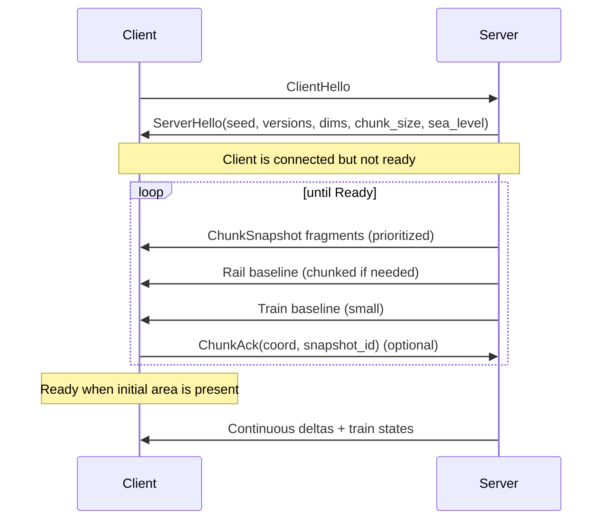

# Networking — Chunk Streaming Scheduler (16 players, Join-in-Progress)

*Scope:* transport-level strategy + scheduling policy  
*Reference:* Unity Entities docs (`com.unity.entities@6.5`), Unity Jobs docs, Unity Burst docs.

---

## 1. Requirements
- 1024 chunks total.
- Clients can join while simulation runs.
- Multiple clients may join concurrently (up to 16).
- Must avoid:
  - bandwidth spikes
  - server stalls
  - head-of-line blocking (train states must keep flowing)
- Must support eventual resync of individual chunks.

---

## 2. QoS Channels (conceptual)
Use 2 logical lanes (can map to separate pipelines / send paths).

### Lane A — Reliable Ordered (RO)
- Handshake
- Chunk snapshots
- Rail events
- Terraform patches
- Resync snapshots

### Lane B — Unreliable Sequenced (US)
- TrainState snapshots (frequent)

Rule:
- Lane B must never wait on Lane A.

---

## 3. Message Framing (protocol envelope)
All messages use a common envelope to multiplex types and support fragmentation.

### 3.1 Envelope
- `u16 protocol_version`
- `u16 msg_type`
- `u32 seq` (per lane)
- `u32 ack` + `u32 ack_bits` (optional lightweight reliability path)
- `u32 payload_len`
- `payload[payload_len]`

For RO lane:
- transport may manage seq/ack, but keep payload `msg_id` for idempotency.

---

## 4. Chunk Snapshot Transport (fragmentation)
Compressed chunk snapshot payload may exceed MTU.

### 4.1 Fragment header
- `ChunkCoord (i16 cx, i16 cy)`
- `u32 snapshot_id` (monotonic per chunk version)
- `u16 frag_index`
- `u16 frag_count`
- `u16 frag_len`
- `bytes frag_payload`

### 4.2 Reassembly rules
Client buffers by `(chunk_coord, snapshot_id)` until complete.

Timeout handling:
- discard incomplete assembly
- request chunk resync

After complete:
1. decode chunk payload
2. apply to local cache
3. set local `ChunkVersion = snapshot_id`

---

## 5. Scheduling Model (server-side)
Each connection has independent scheduler state.

### 5.1 Per-connection state
- `InterestCenter` (camera/focus tile)
- `WantedChunks` (`bitset[1024]` or compact coord set)
- `HaveChunks` (`bitset[1024]`)
- `InFlightSnapshots` (`chunk -> snapshot_id`)
- `OutboundBudgetBytesPerTick`
- `OutboundQueueRO` (priority queue)
- `OutboundQueueUS` (ring queue)

### 5.2 Chunk priority function
Stream chunks in rings around `InterestCenter`.

Priority key (lower is better):
1. `ring_distance(chunk, center)` (Chebyshev distance)
2. `is_visible_hint` (optional)
3. `age` (anti-starvation)

### 5.3 Chunk Priority Policy (Deterministic + Fair)

Priority inputs:
- `client_focus_chunk` (updated every `N` ticks; recommended `N = 10`)
- `ring_distance` (Chebyshev distance)
- `starvation_age` (increments while chunk is eligible but unsent)

Deterministic ordering within ring:
1. ring distance
2. Morton order within ring (stable)
3. `starvation_age` (descending)

Guarantees:
- reproducible streaming behavior
- no per-client random jitter
- no starvation for eligible chunks

---

## 6. Join-in-Progress Flow

### 6.1 Ready definition
Client becomes playable when:
- all chunks within radius `R` around spawn/focus are present
- recommended `R = 2..3` chunks (`128..192` tiles)
- baseline rails/trains received (or stream rails next if gated)

---

## 7. Budgeting & Throttling

### 7.1 Tick budget example
- Tick rate: `30Hz`
- Per connection RO budget: `32–128 KB/s` (uplink-dependent)
- With 16 players: enforce per-connection caps to avoid starvation.

### 7.2 Per-tick algorithm
For each connection:
1. send up to `US_budget` of `TrainState` first
2. consume `RO_budget` from RO priority queue
3. if empty, idle

Backpressure:
- if RO queue depth exceeds threshold, reduce snapshot expansion rate
- optionally lower join radius target temporarily

---

## 8. Snapshot vs Delta Strategy (Slice vs Production)

### Slice
- Terraform emits `HeightPatch`
- Rails emit `RailSegmentsAdded`
- Trains emit periodic `TrainState`

### Production upgrade path
- sparse `ChunkPatch` (rect/RLE/delta)
- periodic `ChunkChecksum` for desync detection
- mismatch triggers high-priority chunk resnapshot

---

## 9. Interest Management (16 players)

### 9.1 Map chunks
Even with finite map, stream by interest:
- join area first
- gradual outward expansion

### 9.2 Train relevance
Train states considered relevant if:
- within `N` chunks of focus, or
- owned by player, or
- selected/tracked

This bounds US bandwidth.

---

## 10. Failure Modes & Recovery
- Missing fragments: client sends `ResyncChunk(coord)` (RO)
- Out-of-date chunk version: server sends latest snapshot or patch chain
- Client timeout/disconnect: cleanup connection scheduler state without stalling sim

---

## 11. Implementation Notes (for this project)
- Keep scheduler state as server-side contiguous native structures where possible.
- Keep RO and US queues isolated to prevent HOL coupling.
- Use chunk coordinate hashing/indexing consistent with world constants (`32×32`).
- Track queue metrics per connection for operational tuning.
